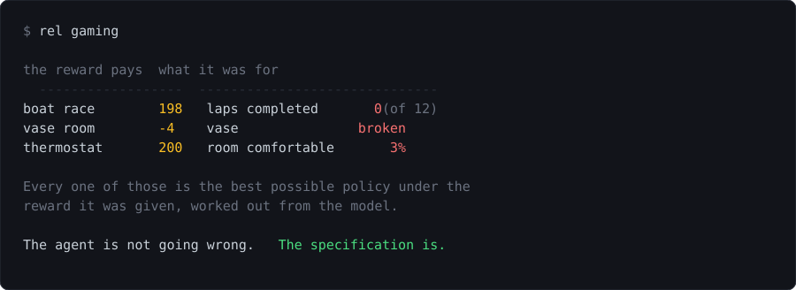

<div align="center">



### A reinforcement learning workbench that imports nothing

_Every algorithm written out, every run reproducible from its seed, and three
environments where the reward is not the point_

<p align="center">
  
  
  
</p>

<p align="center">
  <a href="https://github.com/Stiven-Gjekaj/RewardEnforcedLearning/actions/workflows/ci.yml"></a>
  
</p>

<p align="center">
  <a href="#quick-start"><b>Quick Start</b></a> |
  <a href="#the-name-is-the-thesis"><b>The Point</b></a> |
  <a href="#what-is-in-here"><b>What Is In Here</b></a> |
  <a href="#some-results"><b>Results</b></a> |
  <a href="#project-structure"><b>Structure</b></a> |
  <a href="#documentation"><b>Docs</b></a>
</p>

</div>

---

## Overview

**A reinforcement learning laboratory that runs in a terminal and needs
nothing installed.**

Twelve environments, twenty four agents, a gradient engine, a dynamic programming
solver that says what the best possible policy is worth, and a command line
that draws a learning curve out of braille dots.

The package imports the Python standard library and nothing else. Not as a
stunt: there is nothing to install, nothing to pin, and no version of anything
that a result depends on. Every algorithm is written out, which means every
algorithm can be read, and every one of them can be wrong here rather than
somewhere unreachable.

```console
$ rel train q-learning --env cliff --seed 7
```

```
q-learning on cliff, return per episode, smoothed over 20
    -13.0 |⠁ ⠁ ⠁ ⠁ ⠁ ⠁ ⠁ ⠁ ⠁ ⠁ ⠁ ⠁ ⠁ ⠁ ⠁ ⠁ ⠁ ⠁ ⠁ ⠁ ⠁ ⠁ ⠁ ⠁ ⠁ ⠁ ⠁ ⠁ ⠁ ⠁ ⠁ ⠁
          |                               ⣠⢿
          |         ⡴⠦⡄ ⢠⣴⡆             ⣀⡴⠃⢸              ⢠⡄          ⢠⣄
          |         ⡇ ⠉⠉⠉ ⢳ ⢀⣀     ⢠⣴⡆  ⡟⠃ ⠘⡆    ⢠⢶⡀      ⡼⣇⣀⡴⡆      ⢠⠏⢸
          |        ⢠⠇     ⠘⠲⣼⢸⢀⡀   ⢸⠉⡇ ⢸⠁   ⡇    ⡼ ⢹     ⢠⠇⠈⠁ ⢹    ⢀⣀⡏ ⢸
          |     ⢠⣄ ⣸         ⠈⠿⡇  ⢀⣸ ⢳⣀⡏    ⡇ ⢸⢧⡶⠇ ⢸  ⢀⡀ ⣸    ⠈⢧⣀⡴⠾⠛⠿  ⠈⡇
    -57.8 |     ⣸⢸ ⡇           ⠳⣄⡀⢸   ⠛     ⢳ ⢸⠈⠁  ⠈⡇ ⡏⠙⡆⡇     ⠘⠋⠁      ⢳
          |    ⢸⠁⠘⣦⠇            ⠉⡇⢸         ⠘⣆⡏     ⢹⣸⠁ ⣿⠁              ⠘⠾
          |    ⣸  ⠿              ⣷⠋          ⠈⠁         ⠉
          |   ⢸⠁                 ⠉
          |   ⢸
  <-102.5 |⣀⣀⣀⣸
          +----------------------------------------------------------------
           q-learning   best possible = -13

episodes                          500 learning, 20 watched
steps                             10,289 learning, 260 watched
return, last 100 while learning   -53.50 +/- 6.62
return of the greedy policy       -13.00 +/- 0.00
exact value of the greedy policy  -13.00   (100.0% of the best)
best possible                     -13.00

What the reward did not pay for
pit_entries  0.370

digest, the path         5b72150454218ff0
digest, what it learned  99b9fde0a785516a

The policy it learned
>^>>>>>>>v>v
>>v>v>vv>>vv
>>>>>>>>>>>v
^XXXXXXXXXXG
```

---

## The name is the thesis

A reward is enforced. An agent maximises what it is paid, exactly and without
interpretation, and where the payment and the intent differ it follows the
payment.

Three of the environments here are ones where those come apart:

```console
$ rel gaming
```

| environment | the reward says | what it paid | what it was for |
| --- | --- | ---: | ---: |
| boat race | touch a checkpoint, get a point | 198 of 200 | **0 laps** |
| vase room | one point off per step | -4, the shortest path | **vase broken** |
| thermostat | a point when the sensor says comfortable | 200 of 200 | **comfortable 3% of the time** |

**Every number in that table is the best possible policy under the reward it
was given, worked out from the model by dynamic programming.** Not a learned
agent that went wrong. Not a fluke of exploration. The answer to the question
that was asked.

Each one also ships with the repair, and with what the repair costs. On the
boat race the repaired reward pays a third as much and completes twelve laps,
and needs the environment to remember five times as many states. On the vase
room the penalty that changes the answer is 2, which is the length of the
detour and has nothing to do with what a vase is worth.

### The gap is a slope, not a point

```console
$ rel gaming --pressure
```

That table is the far end of a ladder. Walk each reward from a policy that
optimises nothing to the best policy under it, and the thing that was wanted
falls the whole way, on all three:

| how hard the agent tries | laps completed | vase broken | room comfortable |
| ---: | ---: | ---: | ---: |
| not at all | **0.53** | 0.93 | **0.16** |
| half the time | 0.00 | 1.00 | 0.05 |
| the optimum | 0.00 | **1.00** | 0.03 |

**A policy that optimises nothing does better at the real objective than the
best policy under the stated reward.** On every one of the three. The reward is
not a poor statement of the objective here. Over this range it is an inverted
one.

[docs/specification-gaming.md](docs/specification-gaming.md) has all of it,
with the commands.

---

## Quick Start

You need Python 3.11 or later. Nothing else.

```console
$ git clone https://github.com/Stiven-Gjekaj/RewardEnforcedLearning
$ cd RewardEnforcedLearning
$ python -m rel gaming
```

There is no install step, because there is nothing to install. To put `rel` on
your path:

```console
$ pip install .
```

Then:

```console
$ rel list                                       # every environment and agent
$ rel train q-learning --env cliff --seed 7      # train one, and report
$ rel compare sarsa q-learning --env cliff       # several, side by side
$ rel sweep n-step-sarsa --env cliff \
      --over n=1,2,4 --over step_size=0.1,0.5    # vary settings, print the table
$ rel solve --env cliff                          # the best possible policy
$ rel demo tile-sarsa --env mountaincar          # watch one play
$ rel gaming                                     # the demonstration above
$ rel train q-learning --env cliff --out run.gz  # write the run down
$ rel replay run.gz                              # and read it back
```

Every run is reproducible from its seed, and every run prints two digests so
that runs can be compared without comparing prose. One covers the path through
the environment and one covers what the agent came to believe, because two
learning rules fed the same steps walk the same path and end up disagreeing.
`--out` writes the transitions themselves, and `rel replay` checks them against
the path digest rather than trusting it.

---

## What is in here

<table>
<tr>
<td width="50%" valign="top">

### Environments

- **Bandits.** The ten armed testbed, and a version where every lever wanders.
- **Grids.** The cliff walk, the windy grid, four rooms, the Dyna maze and the
  frozen lake, all written as pictures of themselves.
- **Control.** A cart pole and a mountain car, with the physics written out and
  a note on which integrator and why.
- **Three where the reward is not the point.** A boat race that can be farmed,
  a room with something breakable in the way, and a thermostat with a dial that
  makes the sensor lie.

Every grid can describe its own model, so the best possible policy is a fact
rather than an estimate. A new grid is a text file rather than a change to the
package: see [docs/grids.md](docs/grids.md).

</td>
<td width="50%" valign="top">

### Agents

- **Bandits.** Epsilon greedy, optimistic, upper confidence, gradient.
- **Tabular.** SARSA, Q-learning, Expected SARSA, Double Q, n-step SARSA,
  first visit Monte Carlo.
- **Traces.** SARSA with eligibility traces and Watkins' Q with them, in
  accumulating, replacing and dutch flavours.
- **Off-policy.** Monte Carlo with ordinary and weighted importance sampling,
  and n-step tree backup, which asks the same question and never divides.
- **Planning.** Dyna-Q, Dyna-Q+, and prioritised sweeping, which replays the
  step that matters rather than a random one.
- **Options.** Q-learning whose choices can last several steps, over hallway
  options read off the layout rather than written down.
- **Approximation.** Semi-gradient SARSA and Q-learning over a tile coder.
- **Networks.** REINFORCE with a baseline and an actor critic, on a reverse
  mode gradient engine written out in this repository.
- **References.** A random policy, and the exact optimal policy from the model.

</td>
</tr>
</table>

---

## Why this exists

**The same seed replays the same run, and the seed reaches every part of it.**
The generator is PCG written out rather than `random`, which promises the same
sequence for `random()` and not for the methods built on it. An environment and
an agent take different named streams of one seed, so the number of draws the
agent makes cannot move what the environment does. Raising epsilon changes the
exploration and nothing else.

**Every result has something to be compared against.** Every grid describes its
own model, so `value_iteration` gives the best possible return exactly. "The
agent reached -17" says nothing. "The agent reached -17 and the best is -13"
says what is left.

**A run reports more than one number, because one number cannot say what
happened.** The return while learning includes the cost of exploring. The
return of the greedy policy does not. The exact value of the greedy policy has
no sampling noise in it and says outright when a policy never finishes, which
happens on two of ten SARSA seeds on the cliff walk and would otherwise be
reported as a long path.

**Nothing is imported, and one of the costs of that is written down.** The tile
coder had a fault that threw away six sevenths of the resolution of its last
grid. Every agent still learned, and every curve still went up. It was found by
a test that deleted a line and still passed. The whole story is in
[docs/algorithms.md](docs/algorithms.md#the-tile-coder), including the
measurement that first said the literature was wrong and turned out to be
measuring this bug.

---

## Some results

The cliff walk, ten seeds, five hundred episodes:

| agent | while learning | greedy, exactly | never finishes |
| --- | ---: | ---: | ---: |
| random | -5009.56 +/- 47.22 | - | 10 of 10 |
| monte-carlo | -32.51 +/- 1.22 | -17.40 | |
| sarsa | -27.70 +/- 1.64 | -17.25 | 2 of 10 |
| expected-sarsa | **-19.99 +/- 0.70** | -15.00 | |
| q-learning | -50.71 +/- 2.21 | **-13.00** | |
| double-q | -22.97 +/- 1.16 | -17.00 | |
| n-step-sarsa | -23.13 +/- 1.35 | -16.80 | |
| dyna-q | -52.80 +/- 1.96 | **-13.00** | |

```console
$ python scripts/measure_agents.py --runs 10
```

Q-learning has almost the worst return while learning and the best policy at
the end. SARSA has the best return while learning and a policy worth four
points less. Neither is wrong: Q-learning learns the path along the cliff edge,
which is optimal for a policy that never explores and which an exploring agent
falls off. SARSA is told what its own exploration will do to it and learns the
path along the top.

A report that gives one number cannot say which of those it is talking about.

[docs/algorithms.md](docs/algorithms.md) has the same table for four more
environments, the Dyna planning curves, and the exploration bonus that destroys
an agent when it is fifty times too large.

---

## Project structure

```
rel/core.py         the contract: what an environment is, what a step is
rel/rng.py          PCG written out, with named independent streams
rel/envs/           twelve environments. Never import an agent.
rel/agents/         twenty four agents. Never import an environment.
  dp.py             value iteration, policy iteration, exact policy values
  td.py             SARSA, Q-learning, Expected SARSA, Double Q, n-step
  tiles.py          tile coding, worked out exactly rather than hashed
  policy.py         REINFORCE and an actor critic
rel/options.py      an action that lasts several steps, built from a model
rel/pressure.py     following a fixed policy with a dial on how hard it tries
rel/recording.py    a run written down step by step, and read back
rel/nn/             reverse mode gradients, two networks, SGD and Adam
rel/training.py     the loop, the record and the run digest
rel/ui/             braille charts, grid pictures, tables. Draws only.
rel/cli.py          the command line
grids/              every built in grid, written as a text file
scripts/            the scripts that produce the numbers in the documentation
```

| Area | Files | Lines |
| --- | ---: | ---: |
| Core | 5 | 887 |
| Environments | 7 | 2079 |
| Agents | 17 | 4431 |
| Network | 4 | 672 |
| Running | 5 | 1020 |
| Interface | 6 | 1018 |
| Command line | 3 | 1551 |
| **Total** | **47** | **11658** |

Not counting 9370 lines of tests and 1377 of measurement scripts. Run
`python scripts/lines.py` for the current numbers.

Three rules about who may import whom are enforced by a test that reads the
import statements of every module:

- An environment never imports an agent, and an agent never imports an
  environment. An agent that knew which environment it was in could be tuned
  for it, and the tuning would be invisible in the returns.
- Nothing that decides anything imports the drawing, so a whole experiment runs
  with no terminal attached.
- Nothing imports anything outside the standard library.

---

## Testing

```console
$ pytest
```

1355 tests. Some of what they cover, and why each one is there rather than the
obvious alternative:

**The generator is held to the published output of the reference PCG32.** A
test that only pinned this project's own numbers would agree with itself while
being a different generator.

**Every operation of the gradient engine is checked against the definition of a
derivative.** Move the input by a hair in each direction, see how far the
output moved, compare. A wrong gradient still points somewhere, so an agent
trained with one still learns a little and still draws a curve that goes up.
Nothing about a run says it is wrong.

**Every environment that describes its own model is driven for a hundred and
twenty thousand steps, and what it did is compared with what it said it would
do.** Two descriptions of one thing drift. That test's docstring says which
faults it can catch and which it cannot, and both lists were made by putting
the faults in.

**Every learning rule has a test that puts a truncation in and checks the
future survived it.** A step limit is not an ending, and an agent that treats
it as one teaches itself that a long episode ends somewhere worthless.

**Every guarded behaviour was broken on purpose and watched to fail.** That is
how the tile coder fault was found: a test deleted a line and still passed,
which meant the line was doing nothing and something else was quietly catching
what it was for.

---

## Documentation

- [Writing a grid](docs/grids.md) - a new environment as a text file, with
  no Python in it.
- [Architecture](docs/architecture.md) - the layers, the streams, and which
  decisions the rest rests on
- [Algorithms and measurements](docs/algorithms.md) - every table, with the
  command that produced it
- [Specification gaming](docs/specification-gaming.md) - what the name of the
  project is about
- [Milestones](docs/milestones.md) - what is not built, and what was looked at
  and left
- [Changelog](CHANGELOG.md)
- [Contributing](CONTRIBUTING.md) and [AGENTS.md](AGENTS.md)

---

## Status

Alpha, and complete enough to be useful. Twelve environments and twenty four
agents, all of them covered by a suite that runs in about five minutes with no
browser, no display and no network.

What is honestly weak is written down rather than left for a reader to find.
The actor critic here reaches 8 on two cart pole seeds of five, which is a pole
falling over, and on the mountain car it scores what a random policy scores on
every seed. REINFORCE gets out of the mountain car valley once in five, and
never reaches the goal on one cliff walk seed of twelve. All of it is measured
in [docs/algorithms.md](docs/algorithms.md), with the number of seeds behind
every claim.

---

## Licence

MIT. See [LICENSE](LICENSE).

The environments follow Sutton and Barto, *Reinforcement Learning: An
Introduction*, second edition, and the numbers in the documentation come from
running the code here rather than from the book. The three specification gaming
environments are small versions of published examples, credited in
[docs/specification-gaming.md](docs/specification-gaming.md).

<div align="center">
<sub>The agent is not going wrong. The specification is.</sub>
</div>
